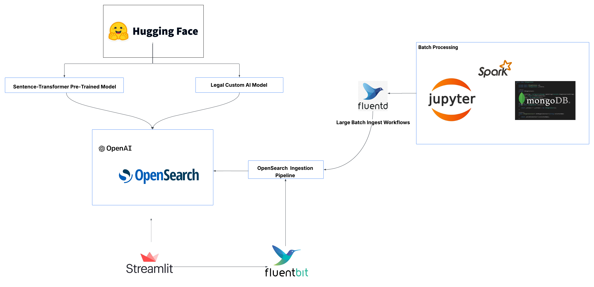

# ⚖️ Legal AI Assistant – RAG-Powered Legal Search Platform


> **A turnkey, end-to-end Retrieval-Augmented Generation (RAG) stack for legal research and contract analysis.**
> *Hybrid search ➜ semantic rerank ➜ LLM answer ➜ clickable citations — all containerised, auditable, and ready for air-gapped deployment.*

---

## ✨ Key Highlights

| Theme                              | What Makes It Stand Out                                                                                                                                                                                                                                 |
| ---------------------------------- | ------------------------------------------------------------------------------------------------------------------------------------------------------------------------------------------------------------------------------------------------------- |
| **Audit-grade traceability** | Every answer links to paragraph-level sources; OpenSearch stores the full reasoning chain.                                                                                                                                                              |
| **Math-backed relevance**    | [BM25](https://en.wikipedia.org/wiki/Okapi_BM25) + [dense vectors](https://docs.opensearch.org/docs/latest/vector-search/vector-search-techniques/index/) + cross-encoder rerank with tunable blend factor α.                                                |
| **Model freedom**            | Hot-swap between [GPT-4o](https://openai.com/gpt-4o) (cloud) **or** purpose-built legal models: [SaulLM-54B-Instruct](https://huggingface.co/Equall/SaulLM-54B-Instruct) (state-of-the-art legal reasoning) and quantized GGUF variants ([SaulLM-7B-GGUF](https://huggingface.co/TheBloke/SaulLM-7B-GGUF), [law-LLM-GGUF](https://huggingface.co/TheBloke/law-LLM-GGUF)) for offline deployment. |
| **Zero-code pipelines**      | Ingest & Search pipelines defined as YAML; drag-and-drop new templates.                                                                                                                                                                                 |
| **Sovereign by default**     | Keep docs, embeddings, and chat history inside your datacenter; cloud calls are opt-in.                                                                                                                                                                 |

---

## 🧠 Why Hybrid RAG for Legal?

Legal research demands a unique blend of precision and comprehension that traditional search engines cannot provide. Our hybrid RAG approach addresses the specific challenges legal professionals face when analyzing case law, statutes, and contracts:

- **Precise citations** — Judges quote *exact* language; BM25 guarantees token-level matches for verbatim text retrieval, ensuring you never miss critical statutory language or case holdings.
- **Implicit precedent** — Dense vector embeddings surface semantically similar rulings even when terminology differs across jurisdictions, time periods, or legal traditions, enabling discovery of relevant precedent that keyword search would miss.
- **Explainable AI** — Cross-encoder scores and LangGraph traces enable expert review and fine-tuning, providing the transparency and auditability that legal work demands.
- **Latency / cost trade-off** — Local GGUF models run under 8 GB RAM for air-gapped environments; GPT-4o is one flag away when premium accuracy is needed for high-stakes analysis.


## 📸 Architecture Diagram



## 🏗️ Architecture


### The Legal AI Model Advantage

This platform leverages cutting-edge legal-specific language models that understand the nuances of legal reasoning. At its core is SaulLM-54B-Instruct, a collaborative research breakthrough that represents the state-of-the-art in domain-adapted legal AI.

#### **[SaulLM-54B-Instruct](https://huggingface.co/Equall/SaulLM-54B-Instruct) — State-of-the-Art Legal AI**

Developed through a collaboration between [Equall](https://huggingface.co/Equall) and MICS at CentraleSupélec (Université Paris-Saclay), SaulLM-54B-Instruct is a groundbreaking 54 billion parameter model that represents the pinnacle of legal domain adaptation. Built through continuous pretraining of Mixtral's architecture, this model was specifically designed to understand the complexities of legal reasoning and documentation.

- **Domain-Specific Training** — Trained on rich datasets comprising European and US legal texts, court rulings, and legislative documents
- **Multi-Jurisdictional Knowledge** — Demonstrates superior understanding of both US and European legal systems
- **Research-Backed Performance** — Published findings in ["SaulLM-54B & SaulLM-141B: Scaling Up Domain Adaptation for the Legal Domain"](https://arxiv.org/abs/2407.19584) (arXiv:2407.19584) show significant improvements over general-purpose LLMs on legal benchmarks
- **MIT Licensed** — Open source availability enables transparency and customization for legal applications

**Legal Reasoning Capabilities:**

- **Contract Analysis** — Understanding complex contractual language, identifying key clauses, and assessing enforceability
- **Statutory Interpretation** — Parsing legislative text and regulatory frameworks with precision
- **Case Law Precedents** — Connecting legal principles across different cases and jurisdictions
- **Compliance Assessment** — Evaluating regulatory compliance and identifying potential legal risks
- **Cross-Jurisdictional Reasoning** — Bridging legal concepts between US and European legal traditions

**Ethical Considerations & Limitations:**

As noted in the model documentation, SaulLM-54B-Instruct is a research artifact designed to support legal research and should be used responsibly. The model provides information for research purposes only and should not be interpreted as legal advice. Users must critically evaluate outputs and seek qualified legal professionals for actual legal guidance. The model's training focused on US and European legal systems, so performance may vary for other jurisdictions.

#### **[ModernBERT Legal Embeddings](https://huggingface.co/legaltextai/modernbert-embed-ft-const-legal-matryoshka) — Specialized Legal Vector Search**

Complementing our language models is the **ModernBERT Embed Legal Matryoshka** model from [LegalTextAI](https://huggingface.co/legaltextai), specifically fine-tuned for legal document embeddings. This sentence-transformer model is built on the ModernBERT architecture and optimized for legal text semantic similarity and search tasks.

- **Legal Domain Adaptation** — Fine-tuned specifically on legal constitutional datasets for superior performance on legal text
- **Extended Context** — 8,192 token maximum sequence length, ideal for processing lengthy legal documents and complex clauses
- **High-Dimensional Vectors** — 768-dimensional embeddings with cosine similarity for precise semantic matching
- **Matryoshka Architecture** — Efficient embedding extraction at multiple dimensions for performance optimization
- **Apache 2.0 Licensed** — Open source availability for transparency and customization

**Technical Specifications:**

- **Base Model**: nomic-ai/modernbert-embed-base
- **Architecture**: Sentence Transformer with mean pooling and normalization
- **Training**: Fine-tuned using MatryoshkaLoss and MultipleNegativesRankingLoss for enhanced legal text understanding
- **Use Cases**: Semantic search, document similarity, contract clause matching, precedent discovery

This embedding model powers the dense vector component of our hybrid search, ensuring that semantically similar legal concepts are discovered even when exact keyword matches don't exist.

**Quantized Legal Models** — For resource-constrained or air-gapped deployments, we provide optimized GGUF variants including [SaulLM-7B-GGUF](https://huggingface.co/TheBloke/SaulLM-7B-GGUF) and [law-LLM-GGUF](https://huggingface.co/TheBloke/law-LLM-GGUF) that maintain legal reasoning capabilities while running efficiently on standard hardware (under 8GB RAM), ensuring legal professionals can access AI assistance regardless of infrastructure constraints.

---

## 🔍 Ranking Mathematics (Under the Hood)

| Stage                   | Equation / Logic                                                                                                                                                                                                                      | Default k | Notes                                              |      |                     |
| ----------------------- | ------------------------------------------------------------------------------------------------------------------------------------------------------------------------------------------------------------------------------------- | --------- | -------------------------------------------------- | ---- | ------------------- |
| **BM25**          | [Okapi BM25](https://en.wikipedia.org/wiki/Okapi_BM25): `<sub>`score`</sub>`(q,D)=Σ`<sub>`t∈q∩D`</sub>` *IDF*·(tf`<sub>`D,t`</sub>`(k₁+1))/(tf`<sub>`D,t`</sub>`+k₁·(1-b+b·                                    | D         | /avgdl))                                           | 1000 | k₁ = 1.2, b = 0.75 |
| **Dense KNN**     | [Dense Vector Search](https://docs.opensearch.org/docs/latest/vector-search/vector-search-techniques/index/): sim = 1 − cos θ = 1 − (v`<sub>`q`</sub>`·v`<sub>`D`</sub>`/‖v`<sub>`q`</sub>`‖‖v`<sub>`D`</sub>`‖) | 256       | HNSW (M=32, ef=200) on 768-d embeddings            |      |                     |
| **Hybrid blend**  | **H = α·BM25 + (1-α)·sim**                                                                                                                                                                                                  | —        | α = 0.4 (pipeline parameter)                      |      |                     |
| **Cross-encoder** | BERT-style pair scorer on top-k hits                                                                                                                                                                                                  | 200       | Model ID `legal-cross-encoder-v1`                |      |                     |
| **RAG prompt**    | Query + top contexts ➜ LLM                                                                                                                                                                                                           | 20        | Citations injected as XML tags (`<doc id="…">`) |      |                     |

---


```text
┌─────────────┐ ingest docs ┌─────────────────┐ hybrid search ┌──────────────┐
│ Ingest UI   │ ───────────────────▶ │ OpenSearch 3.0 │ ───────────────────▶ │ LangGraph RAG │
└─────────────┘                │ • vector & BM25│                │ • LLM answer │
        ▲                      │ • ML Commons  │                │ • citations  │
        │ Streamlit chat       └─────────────────┘                └──────────────┘
        ▼
┌─────────────┐ REST ┌──────────────────────┐ WebSocket ┌──────────────────┐
│ End Users   │──────▶│ FastAPI + MCP Server │───────────▶│ Streamlit UI    │
└─────────────┘      └──────────────────────┘           └──────────────────┘
```

### Pipeline Layers

- **Ingest Pipeline** → chunk ▸ clean ▸ embed ▸ index.
- **Search Pipeline** → hybrid query ▸ cross-encoder rerank.
- **RAG Pipeline** → OpenAI (or local GGUF) answer ▸ return JSON to UI.

---

## 🚀 Quickstart

1. **Launch**: `docker-compose up -d`
2. **Access**: Open the Streamlit UI at `http://localhost:8501`
3. **Select Model**: Choose from GPT-4, o4-mini, or any configured local model
4. **Query**: Submit a legal question (e.g., *"Is this contract enforceable without consideration?"*)
5. **Answer**: View RAG results with citations and source links

```bash
git clone https://github.com/your-org/legal-ai-assistant.git
cd legal-ai-assistant
cp .env.sample .env          # add OPENAI_API_KEY if you want GPT-4o
docker compose pull
docker compose up -d

# open the demo
open http://localhost:8501
```

Choose Model — GPT-4o (cloud) or SaulLM-7B / law-LLM (offline).

Ask — "Is consideration required for a valid NDA in Florida?"

Review — Answer, highlighted sources, token & latency stats.

## 🤖 Supported LLMs

| Name                                                                      | Size | Quant    | Best For                          | Notes                                                         |
| ------------------------------------------------------------------------- | ---- | -------- | --------------------------------- | ------------------------------------------------------------- |
| [OpenAI GPT-4o](https://platform.openai.com/docs/models/gpt-4o)           | —    | API      | Maximum reasoning, multilingual   | Needs OPENAI_API_KEY.                                         |
| [TheBloke/SaulLM-7B-GGUF](https://huggingface.co/TheBloke/SaulLM-7B-GGUF) | 7 B  | Q4_K_M   | Fast CPU inference, summarisation | Finetuned on legal & finance corpora; 8 GB RAM ≈ 10 tokens/s. |
| [TheBloke/law-LLM-GGUF](https://huggingface.co/TheBloke/law-LLM-GGUF)     | 7 B  | Q4_K_M   | Statute & case-law Q&A            | Specialised on US code + Caselaw Access Project.              |

---

## 🔍 Core Features (Expanded)

- **Full-stack Hybrid Search** — Hybrid Search blends BM25 + KNN in one request, leveraging both token-level keyword matching and semantic retrieval via vector similarity for maximum legal relevance.
- **Cross-Encoder Plug-in** — Swap any sentence-BERT cross-encoder via the ML Registry; enables advanced reranking on legal text pairs for higher accuracy.
- **Workflow Automation** — Use Workflow Automation YAML to declaratively define pipelines, automating every step from ingest to search and rerank.
- **Observability** — Integrated Prometheus + Grafana dashboards; track query latency, LLM token spend, pipeline events, and system health.
- **Security** — Supports TLS, API key authentication, RBAC, and opt-in redaction for any off-prem API calls.
- **Batch + Real-Time Ingest** — Handle PDFs, legal docs, and logs via batch Spark jobs, notebook ETL, or ad-hoc UI drag-and-drop.
- **Memory by OpenSearch** — Stores all message, embedding, and chat context in OpenSearch native memory (>=2.12), eliminating manual stitching or external DBs.
- **Auditable RAG Reasoning** — Every LangGraph run traces the full reasoning chain: hybrid retrieval, rerank scores, prompt injection, and LLM answer for legal review.

## 🔐 Privacy & Security

This platform is designed to support local inference workflows using self-hosted models and on-premise OpenSearch clusters. No data is sent to external APIs unless explicitly configured (e.g., OpenAI).

---

## 🎯 Motivation & Design

Inspired by the [OpenSearch Semantic Search Workshop](https://github.com/opensearch-project/opensearch-workshops/tree/main/semantic-search) and [AWS Samples Semantic Search with Amazon OpenSearch](https://github.com/aws-samples/semantic-search-with-amazon-opensearch), this platform:

- Operationalizes OpenSearch ML features (>= 2.11)
- Integrates pretrained and remote models for embeddings and reranking
- Provides a self-hosted, on-premise option to keep sensitive data in-house
- Offers a plug-and-play UI for legal professionals
- Built by an AWS Solutions Architect specializing in AI search — leveraging all new ML-powered and memory features of modern OpenSearch

**Goals:**

- End-to-end ML pipelines for legal workflows
- Zero-code model orchestration via LangGraph
- Full containerization for simple deployment and scaling
- Audit, test, and explain every step in the legal research chain

---

## 🛠️ Tech Stack

| Layer         | Technology                                                                                                                                                            |
| ------------- | --------------------------------------------------------------------------------------------------------------------------------------------------------------------- |
| Frontend      | Streamlit                                                                                                                                                             |
| Orchestration | LangGraph MCP + FastAPI                                                                                                                                               |
| Search        | OpenSearch 3.0 (Hybrid + ML Commons)                                                                                                                                  |
| Storage       | Redis (chat) · MongoDB (metadata)                                                                                                                                     |
| Ingest        | Fluent Bit · Fluentd · Apache Spark                                                                                                                                   |
| LLMs          | [GPT-4o](https://openai.com/gpt-4o) · [SaulLM-7B-GGUF](https://huggingface.co/TheBloke/SaulLM-7B-GGUF) · [law-LLM-GGUF](https://huggingface.co/TheBloke/law-LLM-GGUF) |
| Deployment    | Docker Compose                                                                                                                                                        |

## 💡 Unique Capabilities

### ✅ Multi-Model LLM Switching

A dropdown lets users select models live without code changes:

- [OpenAI GPT-4o](https://openai.com/gpt-4o), [GPT-4.1](https://platform.openai.com/docs/models/gpt-4)
- o3, o4, o4-mini, o3-pro
- HuggingFace or local models (optional)

This enables flexible tradeoffs between **speed, cost, and output quality**.

---

### 🔁 Workflow Automation with OpenSearch 2.13+

Using [OpenSearch Workflow Automation](https://opensearch.org/docs/latest/ml-commons/workflow-automation/), you can define end-to-end ML pipelines in YAML or JSON.

**Use cases covered:**

- Ingest & preprocessing pipelines
- AI connector configuration
- Hybrid search setup
- LLM reranking, sentence scoring, and query generation

📘 Also see:

- [OpenSearch 2.13 Release Blog](https://opensearch.org/blog/releases/2024/03/opensearch-2-13-0-released/)
- [Workflow Templates](https://opensearch.org/docs/latest/ml-commons/workflow-automation/#use-case-templates)

---

### 🔍 Hybrid Search with OpenSearch

This project uses [Hybrid Search](https://opensearch.org/docs/latest/search-plugins/hybrid-search/) to combine:

- **BM25 (keyword)** relevance scoring
- **Dense vector (ANN/KNN)** embeddings
- **Reranking** using ML models (cross-encoders, etc.)

This improves accuracy in legal workflows that require both **exact citations and conceptual relevance**.

---

### 🧠 Remote + Pretrained Model Support

OpenSearch supports remote and in-cluster models for:

- Dense embedding (e.g., legal-text2vec)
- Sparse neural search (token-weight pairs)
- Cross-encoders (reranking)
- Sentence scoring and summarization

📚 Related OpenSearch features:

- [Pretrained Model Registry](https://opensearch.org/docs/latest/ml-commons/pretrained-models/)
- [Sparse Encoding Models – v2.11+](https://opensearch.org/docs/latest/ml-commons/sparse-encoding/)
- [Cross-Encoder Models – v2.12+](https://opensearch.org/docs/latest/ml-commons/cross-encoder/)
- [Semantic Sentence Highlighting – v3.0+](https://opensearch.org/docs/latest/ml-commons/semantic-highlighting/)

---

## 🧩 Ingest Pipelines + Search Pipelines

The app leverages two core types of OpenSearch-native workflows:

### 🔄 **Ingest Pipelines**

- Chunk, clean, and embed documents
- Enrich metadata
- Index content with vector + text fields

**Tools:**

- [Fluent Bit](https://fluentbit.io/) ([Docs](https://docs.fluentbit.io/))
- [Fluentd](https://www.fluentd.org/) ([Docs](https://docs.fluentd.org/))
- [Apache Spark](https://spark.apache.org/) ([Docs](https://spark.apache.org/docs/latest/))
- [Jupyter Notebooks](https://jupyter.org/) ([Docs](https://docs.jupyter.org/))

### 🔎 **Search Pipelines**

- Route queries through hybrid search
- Apply reranking (e.g., cross-encoder)
- Serve final context to LangGraph RAG module

**Orchestrated via:**

- [LangGraph](https://github.com/langchain-ai/langgraph)
- [FastAPI](https://fastapi.tiangolo.com/)

---

## 📦 Example Workflows

- **Contract Validity Check** — clause extraction ➜ hybrid search for precedent ➜ GPT-4o summary.
- **Case-Law Benchmarking** — run same query across 3 models; Streamlit heat-map compares BLEU.
- **Bulk PDF Ingestion** — drop folder in docs/; Makefile triggers Spark pipeline ➜ index.
- **Legal Q&A Memory** — all previous answers available for context in chat; no external KV store needed.
- **Hybrid Citations** — both direct quote and semantic matches shown with clickable links and document provenance.

## 📈 Roadmap

- 🔒 OAuth2 & fine-grained Doc ACLs
- 🖇️ Drag-and-drop PDF upload in UI
- 💬 Vector-aware chat memory via Redis TTL
- ✨ Semantic highlighting (OpenSearch 3.1)
- 📝 Human-in-the-loop legal annotation UI

---

> ⚠️ This tool is for research and development purposes only. It does not constitute legal advice or replace professional legal counsel.

## 📜 License / Disclaimer

Released under the Apache-2.0 license. Nothing here constitutes legal advice.

Fork, star, or open an issue if you'd like to contribute! 🚀
