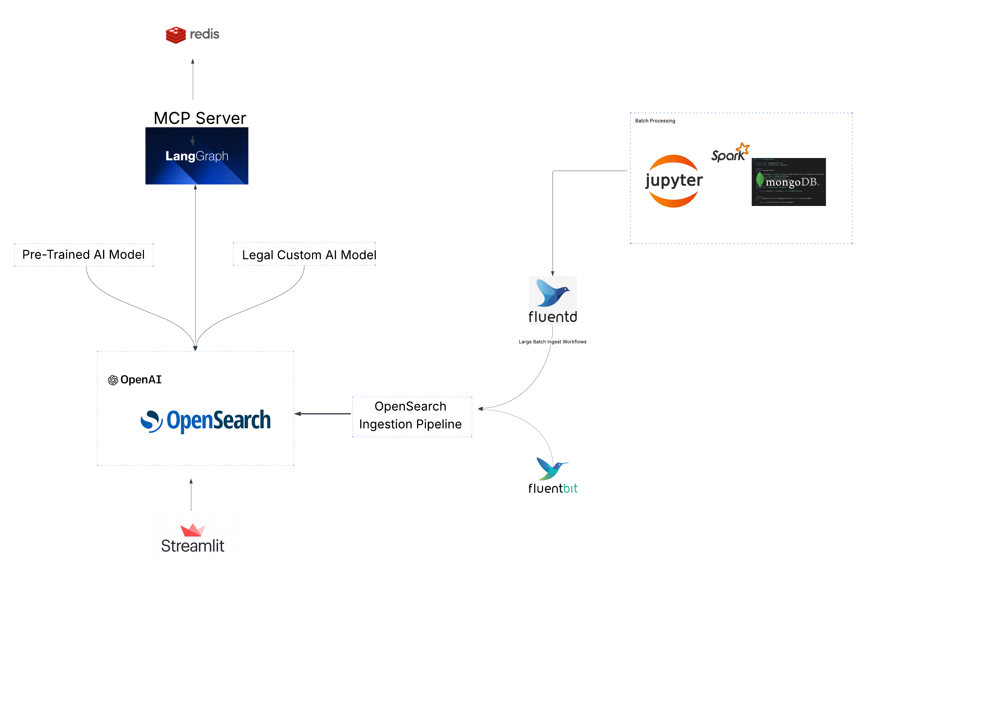

# ⚖️ Legal AI Assistant – RAG-Powered Legal Search Platform


> **A turnkey, end-to-end Retrieval-Augmented Generation (RAG) stack for legal research and contract analysis.**  
> *Hybrid search ➜ semantic rerank ➜ LLM answer ➜ clickable citations — all containerised, auditable, and ready for air-gapped deployment.*

---

## ✨ Key Highlights

| Theme                        | What Makes It Stand Out                                                                     |
| ---------------------------- | ------------------------------------------------------------------------------------------- |
| **Audit-grade traceability** | Every answer links to paragraph-level sources; OpenSearch stores the full reasoning chain.  |
| **Math-backed relevance**    | BM25 + dense vectors + cross-encoder rerank with tunable blend factor α.                    |
| **Model freedom**            | Hot-swap between [GPT-4o](https://openai.com/gpt-4o) (cloud) **or** two bundled *CPU-only* GGUF models for offline work. |
| **Zero-code pipelines**      | Ingest & Search pipelines defined as YAML; drag-and-drop new templates.                     |
| **Sovereign by default**     | Keep docs, embeddings, and chat history inside your datacenter; cloud calls are opt-in.     |

---

## 🧠 Why Hybrid RAG for Legal?

1. **Precise citations** — Judges quote *exact* language; BM25 guarantees token-level matches.  
2. **Implicit precedent** — Vectors surface semantically similar rulings even when terminology differs.  
3. **Explainable AI** — Cross-encoder scores and LangGraph traces enable expert review and fine-tuning.  
4. **Latency / cost trade-off** — Local GGUF models run under 8 GB RAM; GPT-4o is one flag away when premium accuracy is needed.

---

## 🔍 Ranking Mathematics (Under the Hood)

| Stage             | Equation / Logic                                                                                                        | Default k | Notes                                                            |
| ----------------- | ----------------------------------------------------------------------------------------------------------------------- | --------- | ---------------------------------------------------------------- |
| **BM25**          | <sub>score</sub>(q,D)=Σ<sub>t∈q∩D</sub> *IDF*·(tf<sub>D,t</sub>(k₁+1))/(tf<sub>D,t</sub>+k₁·(1-b+b·|D|/avgdl))           | 1000      | k₁ = 1.2, b = 0.75                                               |
| **Dense KNN**     | sim = 1 − cos θ = 1 − (v<sub>q</sub>·v<sub>D</sub>/‖v<sub>q</sub>‖‖v<sub>D</sub>‖)                                       | 256       | HNSW (M=32, ef=200) on 768-d embeddings                           |
| **Hybrid blend**  | **H = α·BM25 + (1-α)·sim**                                                                                              | —         | α = 0.4 (pipeline parameter)                                     |
| **Cross-encoder** | BERT-style pair scorer on top-k hits                                                                                   | 200       | Model ID `legal-cross-encoder-v1`                                 |
| **RAG prompt**    | Query + top contexts ➜ LLM                                                                                              | 20        | Citations injected as XML tags (`<doc id="…">`)                   |

---

## 📸 Architecture Diagram



## 🏗️ Architecture

```
┌─────────────┐ ingest docs ┌─────────────────┐ hybrid search ┌──────────────┐
│ Ingest UI   │ ───────────────────▶ │ OpenSearch 3.0 │ ───────────────────▶ │ LangGraph RAG │
└─────────────┘                │ • vector & BM25│                │ • LLM answer │
        ▲                      │ • ML Commons  │                │ • citations  │
        │ Streamlit chat       └─────────────────┘                └──────────────┘
        ▼
┌─────────────┐ REST ┌──────────────────────┐ WebSocket ┌──────────────────┐
│ End Users   │──────▶│ FastAPI + MCP Server │───────────▶│ Streamlit UI    │
└─────────────┘      └──────────────────────┘           └──────────────────┘
```

### Pipeline Layers

- **Ingest Pipeline** → chunk ▸ clean ▸ embed ▸ index.  
- **Search Pipeline** → hybrid query ▸ cross-encoder rerank.  
- **RAG Pipeline** → OpenAI (or local GGUF) answer ▸ return JSON to UI.

---

## 🚀 Quickstart

1. **Launch**: `docker-compose up -d`
2. **Access**: Open the Streamlit UI at `http://localhost:8501`
3. **Select Model**: Choose from GPT-4, o4-mini, or any configured local model
4. **Query**: Submit a legal question (e.g., _"Is this contract enforceable without consideration?"_)
5. **Answer**: View RAG results with citations and source links

```bash
git clone https://github.com/your-org/legal-ai-assistant.git
cd legal-ai-assistant
cp .env.sample .env          # add OPENAI_API_KEY if you want GPT-4o
docker compose pull
docker compose up -d

# open the demo
open http://localhost:8501
```

Choose Model — GPT-4o (cloud) or SaulLM-7B / law-LLM (offline).

Ask — "Is consideration required for a valid NDA in Florida?"

Review — Answer, highlighted sources, token & latency stats.

## 🤖 Supported LLMs

| Name | Size | Quant | Best For | Notes |
|------|------|-------|----------|-------|
| OpenAI GPT-4o | — | API | Maximum reasoning, multilingual | Needs OPENAI_API_KEY. |
| TheBloke/SaulLM-7B-GGUF | 7 B | Q4_K_M | Fast CPU inference, summarisation | Finetuned on legal & finance corpora; 8 GB RAM ≈ 10 tokens/s. |
| TheBloke/law-LLM-GGUF | 7 B | Q4_K_M | Statute & case-law Q&A | Specialised on US code + Caselaw Access Project. |

## 🔍 Core Features (Expanded)

- Full-stack Hybrid Search — Hybrid Search blends BM25 + KNN in one request.
- Cross-Encoder Plug-in — Swap any sentence-BERT cross-encoder via the ML Registry.
- Workflow Automation — Use Workflow Automation YAML to declaratively define pipelines.
- Observability — Prometheus + Grafana dashboards; track query latency & LLM token spend.
- Security — TLS, API key auth, RBAC; opt-in redaction for off-prem calls.

## 🔐 Privacy & Security

This platform is designed to support local inference workflows using self-hosted models and on-premise OpenSearch clusters. No data is sent to external APIs unless explicitly configured (e.g., OpenAI).

---

## 🎯 Motivation & Design

Inspired by the [OpenSearch Semantic Search Workshop](https://github.com/opensearch-project/opensearch-workshops/tree/main/semantic-search) and [AWS Samples Semantic Search with Amazon OpenSearch](https://github.com/aws-samples/semantic-search-with-amazon-opensearch), this platform:

- Operationalizes OpenSearch ML features (>= 2.11)
- Integrates pretrained and remote models for embeddings and reranking
- Provides a self-hosted, on-premise option to keep sensitive data in-house
- Offers a plug-and-play UI for legal professionals

**Goals:**
- End-to-end ML pipelines for legal workflows
- Zero-code model orchestration via LangGraph
- Full containerization for simple deployment and scaling

---

## 🛠️ Tech Stack

| Layer | Technology |
|-------|------------|
| Frontend | Streamlit |
| Orchestration | LangGraph MCP + FastAPI |
| Search | OpenSearch 3.0 (Hybrid + ML Commons) |
| Storage | Redis (chat) · MongoDB (metadata) |
| Ingest | Fluent Bit · Fluentd · Apache Spark |
| LLMs | GPT-4o · SaulLM-7B-GGUF · law-LLM-GGUF |
| Deployment | Docker Compose |

## 💡 Unique Capabilities

### ✅ Multi-Model LLM Switching

A dropdown lets users select models live without code changes:

- [OpenAI GPT-4o](https://openai.com/gpt-4o), [GPT-4.1](https://platform.openai.com/docs/models/gpt-4)
- o3, o4, o4-mini, o3-pro
- HuggingFace or local models (optional)

This enables flexible tradeoffs between **speed, cost, and output quality**.

---

### 🔁 Workflow Automation with OpenSearch 2.13+

Using [OpenSearch Workflow Automation](https://opensearch.org/docs/latest/ml-commons/workflow-automation/), you can define end-to-end ML pipelines in YAML or JSON.

**Use cases covered:**
- Ingest & preprocessing pipelines
- AI connector configuration
- Hybrid search setup
- LLM reranking, sentence scoring, and query generation

📘 Also see:
- [OpenSearch 2.13 Release Blog](https://opensearch.org/blog/releases/2024/03/opensearch-2-13-0-released/)
- [Workflow Templates](https://opensearch.org/docs/latest/ml-commons/workflow-automation/#use-case-templates)

---

### 🔍 Hybrid Search with OpenSearch

This project uses [Hybrid Search](https://opensearch.org/docs/latest/search-plugins/hybrid-search/) to combine:

- **BM25 (keyword)** relevance scoring  
- **Dense vector (ANN/KNN)** embeddings  
- **Reranking** using ML models (cross-encoders, etc.)

This improves accuracy in legal workflows that require both **exact citations and conceptual relevance**.

---

### 🧠 Remote + Pretrained Model Support

OpenSearch supports remote and in-cluster models for:

- Dense embedding (e.g., legal-text2vec)
- Sparse neural search (token-weight pairs)
- Cross-encoders (reranking)
- Sentence scoring and summarization

📚 Related OpenSearch features:
- [Pretrained Model Registry](https://opensearch.org/docs/latest/ml-commons/pretrained-models/)
- [Sparse Encoding Models – v2.11+](https://opensearch.org/docs/latest/ml-commons/sparse-encoding/)
- [Cross-Encoder Models – v2.12+](https://opensearch.org/docs/latest/ml-commons/cross-encoder/)
- [Semantic Sentence Highlighting – v3.0+](https://opensearch.org/docs/latest/ml-commons/semantic-highlighting/)

---

## 🧩 Ingest Pipelines + Search Pipelines

The app leverages two core types of OpenSearch-native workflows:

### 🔄 **Ingest Pipelines**
- Chunk, clean, and embed documents
- Enrich metadata
- Index content with vector + text fields

**Tools:**
- [Fluent Bit](https://fluentbit.io/) ([Docs](https://docs.fluentbit.io/))
- [Fluentd](https://www.fluentd.org/) ([Docs](https://docs.fluentd.org/))
- [Apache Spark](https://spark.apache.org/) ([Docs](https://spark.apache.org/docs/latest/))
- [Jupyter Notebooks](https://jupyter.org/) ([Docs](https://docs.jupyter.org/))

### 🔎 **Search Pipelines**
- Route queries through hybrid search
- Apply reranking (e.g., cross-encoder)
- Serve final context to LangGraph RAG module

**Orchestrated via:**
- [LangGraph](https://github.com/langchain-ai/langgraph)
- [FastAPI](https://fastapi.tiangolo.com/)

---

## 📦 Example Workflows

- Contract Validity Check — clause extraction ➜ hybrid search for precedent ➜ GPT-4o summary.
- Case-Law Benchmarking — run same query across 3 models; Streamlit heat-map compares BLEU.
- Bulk PDF Ingestion — drop folder in docs/; Makefile triggers Spark pipeline ➜ index.

## 📈 Roadmap

- 🔒 OAuth2 & fine-grained Doc ACLs
- 🖇️ Drag-and-drop PDF upload in UI
- 💬 Vector-aware chat memory via Redis TTL
- ✨ Semantic highlighting (OpenSearch 3.1)

---

> ⚠️ This tool is for research and development purposes only. It does not constitute legal advice or replace professional legal counsel.

## 📜 License / Disclaimer

Released under the Apache-2.0 license. Nothing here constitutes legal advice.

Fork, star, or open an issue if you'd like to contribute! 🚀
